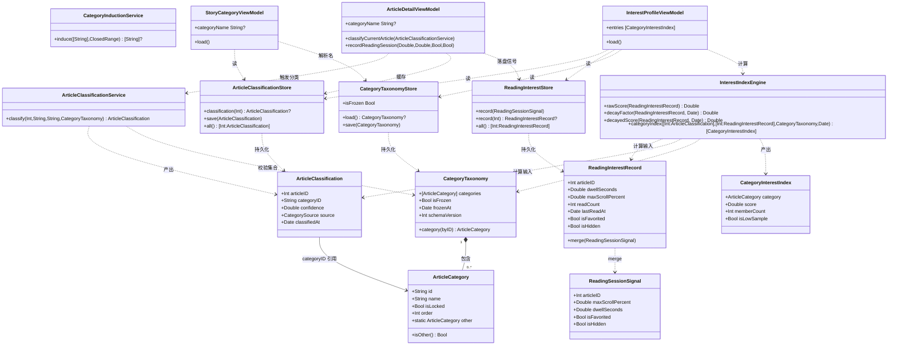
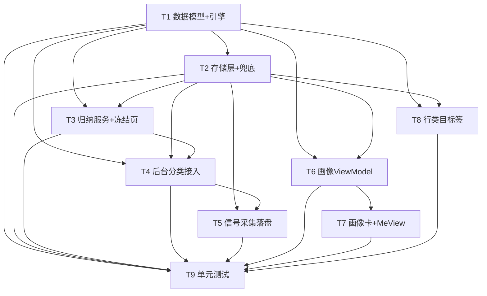

# 文章分类 + 阅读兴趣指数 — 系统设计 & 任务分解

> 配套 PRD：`docs/features/category-interest-prd.md`
> 语言：中文。本文档在「不新增三方依赖、最小侵入现有 MVVM+Repository+Store 结构、指数计算可单测」三项约束下给出落地设计。
> 关键原则：**分类与兴趣数据全程本地**，绝不上报；AI 调用 100% 复用现有 `OpenAICompatibleChatService`（远程 Endpoint+API Key）通道。

---

## 1. 实现方案 + 框架选型

### 1.1 现状确认（设计依据）

| 关注点 | 现有实现 | 本功能如何衔接 |
|---|---|---|
| 文章模型 | `StorySummary`（id/title/images/hint/url）、`ArticleDetail`（body/title…） | **不动**网络 Codable 结构；分类结果落在本地缓存层 |
| 阅读信号 | `ArticleDetailView` 的 `@State readingProgress`（0–1，由 `ArticleScrollObserver` 实时算）+ `ReadQualificationTimer`（`ContinuousClock`+`scenePhase` 前台活跃停留） | 复用两者；新增「落盘」出口 |
| AI 通道 | `AIChatCoordinator` + `OpenAICompatibleChatService.streamReply(...)`（OpenAI 兼容，流式）+ `AIConfigurationStore`（providers+APIKey） | **复用 `streamReply`**（累加 delta 即非流式），不新增网络协议 |
| 存储 | `DiskCacheStore`（actor，JSON 落 `Caches/`）、`AISessionStore`（actor，JSON 落 `Application Support/`）、`HomeViewModel`（UserDefaults+Keychain 存收藏/已读/隐藏） | 新建三个 actor Store，落 `Application Support/`（**不被系统清缓存**），与 `AISessionStore` 同模式 |
| DI | `AppEnvironment` 静态工厂（`makeHomeViewModel`/`makeDetailViewModel`/…） | 扩展 `AppEnvironment` 注入新 Store/Service/ViewModel |
| 行视图 | `StoryRowView` 已用 `AppEnvironment.makeStoryMetricsViewModel(storyID:)` 拉指标 | 同模式新增 `StoryCategoryViewModel` 拉类目 |

### 1.2 难点与决策

1. **分类体系冻结**：由 AI 对真实样本归纳 8–12 个不重叠大类，冻结前弹「你的阅读类目」页让用户删/并/改名（P0-1）。样本不足或无 Key 时退化为**内置默认类目**（仍进冻结页可编辑）。
2. **后台分类最小侵入接入点**：统一在 `ArticleDetailViewModel.load()` 加载完详情后调用 `classifyCurrentArticle(...)`；该方法先查本地缓存命中（去重），未命中再走 AI，**结果写 `ArticleClassificationStore`**（PRD 性能要求：去重+异步）。
3. **阅读信号采集落盘时机**：在 `ArticleDetailView` 的 `.onDisappear` 与 `scenePhase` 变化处，汇总「最大滑动% + 累计前台停留秒数 + 阅读次数 + 最近阅读时间 + 收藏/隐藏标记」提交一次（`ReadingInterestStore` 合并写入，节流由「一次会话提交一次」天然满足 PRD 节流要求）。
4. **复用 `ReadQualificationTimer`**：将其从 `MarkReadAfterViewingModifier` 内部 `@StateObject` **提升为 `ArticleDetailView` 持有**，并新增 `elapsedActiveTime` 访问器供信号采集读取（真正复用前台活跃停留，而非另造一个时钟）。
5. **指数引擎纯函数化**：`InterestIndexEngine` 为**无状态的 `struct` + `static` 方法**，仅依赖传入的 `ReadingInterestRecord`/`ArticleClassification`/`CategoryTaxonomy` 与可变 `now: Date`，**可在任何线程同步调用、可单测**（AC6/AC7 全部由它保证）。
6. **存储落点（关键决策）**：分类缓存、兴趣汇总、类目体系 **全部落 `Application Support/DailyReader/...` 的 JSON 文件**（actor 异步写），**不落 `Caches/`（会被 iOS  purge）**、**不进 Keychain**（数据量较大，Keychain 仅适合小凭证）。`Application Support` 会被 iCloud/iTunes 整机备份，满足「重装/换机不丢」且无需自建 Keychain 迁移。这与现有 `AISessionStore` 落点一致。

### 1.3 框架/库选型

- **不引入任何新三方依赖**（遵守项目「不新增依赖」定调）。Alamofire/Kingfisher 继续仅用于网络与图片，本功能用不到。
- AI 调用复用 `OpenAICompatibleChatService`（`AIChatServicing.streamReply`），不新增协议方法。
- 持久化用 `Foundation` 的 `JSONEncoder/JSONDecoder` + `FileManager`，与 `AISessionStore` 完全一致。
- 展示沿用现有 `DS` 设计令牌（`DS.paperElevated`/`DS.hairline`/`DS.indigo`/`DS.inkSecondary`）与 `RoundedRectangle(cornerRadius:12, style:.continuous)` 纸面卡片风格。

---

## 2. 文件列表（相对路径，基于 `DailyReader/`）

### 2.1 新增文件

| 层 | 路径 | 说明 |
|---|---|---|
| Model | `Models/ArticleCategory.swift` | `ArticleCategory`、`CategoryTaxonomy`、`CategorySource` 枚举、`BuiltInCategoryDefaults`（默认类目 + 关键词兜底表 `LocalCategoryKeywords`） |
| Model | `Models/ArticleClassification.swift` | `ArticleClassification`（articleID→categoryID/confidence/source/classifiedAt） |
| Model | `Models/ReadingInterestRecord.swift` | `ReadingInterestRecord`、`ReadingSessionSignal`（采集输入） |
| Engine | `Services/InterestIndexEngine.swift` | 纯函数指数引擎（单篇 score、时间衰减、类目聚合） |
| Service | `Services/ArticleClassificationService.swift` | 后台 AI 分类（复用 `streamReply`）+ 本地关键词兜底 + 越界/低置信度归「其他」 |
| Service | `Services/CategoryInductionService.swift` | 首次类目归纳（样本→AI 聚类 8–12 大类，失败/无 Key 返回 nil 触发默认类目） |
| Store | `Storage/ArticleClassificationStore.swift` | actor，按 articleID 存 `ArticleClassification`（JSON 文件） |
| Store | `Storage/ReadingInterestStore.swift` | actor，按 articleID 存/合并 `ReadingInterestRecord`（JSON 文件） |
| Store | `Storage/CategoryTaxonomyStore.swift` | actor，存 `CategoryTaxonomy`（含 `isFrozen`、冻结时间） |
| ViewModel | `Features/Home/StoryCategoryViewModel.swift` | 行视图用：`@Published var categoryName: String?`，从存储读类目并解析名 |
| ViewModel | `Features/Me/InterestProfileViewModel.swift` | 画像卡用：聚合分类+兴趣+体系，调用引擎出榜 |
| View | `Features/Interest/CategoryOnboardingView.swift` | 「你的阅读类目」归纳冻结页（删/并/改名 + 完成冻结） |
| View | `Features/Me/InterestProfileCard.swift` | 兴趣画像卡（横向条形榜，降序，「其他」置底弱化，<3 标样本不足） |
| View | `Features/Home/StoryCategoryTag.swift` | 行内 AI 类目胶囊（medium 标题上方 / low 标题与 hint 间 / high 缩为圆点或不显示） |

### 2.2 需改造的现有文件（含改动点）

| 文件 | 改动 |
|---|---|
| `Features/Detail/ArticleDetailViewModel.swift` | 新增 `classificationService`/`interestStore`/`classificationStore` 依赖；`load()` 后调 `classifyCurrentArticle`；新增 `recordReadingSession(maxScrollPercent:dwellSeconds:isFavorited:isHidden:)` 与 `categoryName` 发布 |
| `Features/Detail/ArticleDetailView.swift` | `@StateObject` 持有 `ReadQualificationTimer` 并传入 modifier；`.onDisappear`/scenePhase 处调 `viewModel.recordReadingSession(...)`；`load()` 触发分类 |
| `Features/Detail/ArticleDetailView.swift`（内 `MarkReadAfterViewingModifier`） | 改为接收外部 `ReadQualificationTimer` 参数（不再自建） |
| `Features/Detail/ArticleDetailView.swift`（内 `ReadQualificationTimer`） | 新增 `var elapsedActiveTime: TimeInterval` 访问器 |
| `Features/Home/StoryRowView.swift` | 注入 `StoryCategoryViewModel`；在三种 density 布局中嵌入 `StoryCategoryTag`（仅 `categoryName != nil` 时占位显示） |
| `Features/Me/MeView.swift` | `readingArchive` 下方插入 `InterestProfileCard(viewModel:)`；新增 `interestProfileViewModel` 入参 |
| `AppRootView.swift` | 从 `AppEnvironment` 取共享 Store/Service；`.task` 中在 taxonomy 未冻结且样本足够时触发归纳并 `fullScreenCover` 出 `CategoryOnboardingView`；向 `MeView` 注入 `InterestProfileViewModel` |
| `AppEnvironment`（在 `AppRootView.swift`） | 新增共享 `articleClassificationStore`/`readingInterestStore`/`categoryTaxonomyStore`；`makeArticleClassificationService()`/`makeCategoryInductionService()`；`makeStoryCategoryViewModel(storyID:)`/`makeInterestProfileViewModel()`；`makeDetailViewModel(story:)` 注入新依赖 |

---

## 3. 数据结构和接口

### 3.1 核心类型（Swift）

```swift
// MARK: - Models/ArticleCategory.swift

/// 分类来源：远端 AI / 本地关键词兜底 / 内置默认
enum CategorySource: String, Codable, Equatable, Sendable {
    case remote
    case local
    case `default`
}

/// 一个固定类目。id 为稳定 slug，name 用户可改。
struct ArticleCategory: Identifiable, Codable, Equatable, Hashable, Sendable {
    let id: String            // 稳定标识，如 "tech"、"__other__"
    var name: String          // 显示名，冻结前可改名
    let isLocked: Bool        // "其他" 锁定，不可删/改名/合并
    var order: Int            // 展示顺序（画像榜默认按指数，P1 可拖拽）

    /// 兜底类目，始终存在于体系尾部
    static let other = ArticleCategory(id: "__other__", name: "其他", isLocked: true, order: Int.max)

    /// 判断是否为兜底类
    var isOther: Bool { id == ArticleCategory.other.id }
}

/// 冻结后的类目体系
struct CategoryTaxonomy: Codable, Equatable, Sendable {
    var categories: [ArticleCategory]   // 不含 other；other 由引擎在展示时强制置底
    var isFrozen: Bool
    var frozenAt: Date?
    var schemaVersion: Int

    init(categories: [ArticleCategory], isFrozen: Bool = false,
         frozenAt: Date? = nil, schemaVersion: Int = 1) {
        self.categories = categories
        self.isFrozen = isFrozen
        self.frozenAt = frozenAt
        self.schemaVersion = schemaVersion
    }

    /// 全部有效类目 id（含 other）
    var allCategoryIDs: [String] { categories.map(\.id) + [ArticleCategory.other.id] }

    func category(byID id: String) -> ArticleCategory? {
        if id == ArticleCategory.other.id { return ArticleCategory.other }
        return categories.first { $0.id == id }
    }
}

/// 内置默认类目（归纳不可用时的退化方案）
enum BuiltInCategoryDefaults {
    /// 10 个通用大类（含兜底，共 11，满足 8–12 上界）
    static let categories: [ArticleCategory] = [
        ArticleCategory(id: "tech",        name: "科技",      isLocked: false, order: 0),
        ArticleCategory(id: "business",     name: "商业财经", isLocked: false, order: 1),
        ArticleCategory(id: "society",      name: "社会",      isLocked: false, order: 2),
        ArticleCategory(id: "culture",      name: "文化",      isLocked: false, order: 3),
        ArticleCategory(id: "science",      name: "科学",      isLocked: false, order: 4),
        ArticleCategory(id: "life",         name: "生活",      isLocked: false, order: 5),
        ArticleCategory(id: "health",       name: "健康",      isLocked: false, order: 6),
        ArticleCategory(id: "sports",       name: "体育",      isLocked: false, order: 7),
        ArticleCategory(id: "entertainment",name: "娱乐",      isLocked: false, order: 8),
        ArticleCategory(id: "education",    name: "教育",      isLocked: false, order: 9)
    ]

    /// 本地关键词兜底表：关键词命中即映射该类目；都不命中归 other
    static let keywordMap: [(categoryID: String, keywords: [String])] = [
        ("tech",         ["AI", "人工智能", "芯片", "手机", "互联网", "软件", "编程", "数据"]),
        ("business",     ["股票", "公司", "创业", "投资", "经济", "商业", "市场", "金融"]),
        ("society",      ["社会", "新闻", "政策", "法律", "民生", "舆论", "事件"]),
        ("culture",      ["书", "电影", "音乐", "艺术", "历史", "文学", "文化传统"]),
        ("science",      ["物理", "化学", "生物", "数学", "宇宙", "研究", "实验", "科学"]),
        ("life",         ["旅行", "美食", "家居", "穿搭", "宠物", "日常", "生活方式"]),
        ("health",       ["健康", "医学", "健身", "心理", "疾病", "养生", "睡眠"]),
        ("sports",       ["足球", "篮球", "奥运", "比赛", "运动员", "体育"]),
        ("entertainment",["明星", "综艺", "电视剧", "偶像", "娱乐圈"]),
        ("education",    ["高考", "大学", "考试", "教育", "学习", "学校"])
    ]
}
```

```swift
// MARK: - Models/ArticleClassification.swift

/// 单篇文章的分类结果（本地缓存）
struct ArticleClassification: Codable, Equatable, Sendable {
    let articleID: Int
    var categoryID: String       // 命中 ArticleCategory.id；越界/低置信度一律 other.id
    var confidence: Double       // 0...1
    var source: CategorySource
    var classifiedAt: Date

    init(articleID: Int, categoryID: String,
         confidence: Double, source: CategorySource, classifiedAt: Date = Date()) {
        self.articleID = articleID
        self.categoryID = categoryID
        self.confidence = confidence
        self.source = source
        self.classifiedAt = classifiedAt
    }
}
```

```swift
// MARK: - Models/ReadingInterestRecord.swift

/// 单篇文章的累计阅读兴趣汇总（本地）
struct ReadingInterestRecord: Codable, Equatable, Sendable {
    let articleID: Int
    var dwellSeconds: Double      // 累计前台活跃停留（秒）
    var maxScrollPercent: Double  // 0...1 历史最大滑动%
    var readCount: Int            // 阅读次数
    var lastReadAt: Date          // 最近阅读时间（时间衰减依据）
    var isFavorited: Bool         // 收藏=强正
    var isHidden: Bool            // 不感兴趣=强负

    init(articleID: Int, dwellSeconds: Double = 0, maxScrollPercent: Double = 0,
         readCount: Int = 0, lastReadAt: Date = Date(),
         isFavorited: Bool = false, isHidden: Bool = false) {
        self.articleID = articleID
        self.dwellSeconds = dwellSeconds
        self.maxScrollPercent = maxScrollPercent
        self.readCount = readCount
        self.lastReadAt = lastReadAt
        self.isFavorited = isFavorited
        self.isHidden = isHidden
    }

    /// 合并一次阅读会话信号（用于落盘）
    mutating func merge(_ signal: ReadingSessionSignal) {
        dwellSeconds += max(0, signal.dwellSeconds)
        maxScrollPercent = max(maxScrollPercent, min(1, signal.maxScrollPercent))
        readCount += 1
        lastReadAt = Date()
        isFavorited = signal.isFavorited
        isHidden = signal.isHidden
    }
}

/// 一次阅读会话采集到的原始信号（由 ArticleDetailView 提交）
struct ReadingSessionSignal: Sendable {
    let articleID: Int
    let maxScrollPercent: Double
    let dwellSeconds: Double
    let isFavorited: Bool
    let isHidden: Bool
}
```

```swift
// MARK: - Services/InterestIndexEngine.swift  (纯函数，可单测)

struct InterestIndexEngine {
    /// 单篇停留封顶：≥180s 视为满格
    static let dwellCeilingSeconds: TimeInterval = 180
    /// 时间衰减半衰期（天）
    static let decayHalfLifeDays: Double = 30
    /// 类目样本不足阈值
    static let lowSampleThreshold = 3
    /// 收藏额外强正加成
    static let favoriteBonus: Double = 0.25
    /// 阅读次数满额（达到即拿满 0.2 权重）
    static let readCountFullMark: Double = 5

    private static func clamp01(_ x: Double) -> Double { min(1, max(0, x)) }

    /// 单篇原始得分（未衰减），范围 [0,1]
    static func rawScore(for record: ReadingInterestRecord) -> Double {
        if record.isHidden { return 0 }                       // 不感兴趣≈0
        let scroll = clamp01(record.maxScrollPercent)
        let dwellNorm = clamp01(record.dwellSeconds / dwellCeilingSeconds)
        let readBonus = clamp01(Double(record.readCount) / readCountFullMark)
        var base = 0.4 * scroll + 0.4 * dwellNorm + 0.2 * readBonus
        if record.isFavorited { base = min(1, base + favoriteBonus) }
        return clamp01(base)
    }

    /// 时间衰减因子：decay = 0.5^(Δdays / 30)
    static func decayFactor(for record: ReadingInterestRecord, now: Date = Date()) -> Double {
        let days = max(0, now.timeIntervalSince(record.lastReadAt) / 86_400)
        return pow(0.5, days / decayHalfLifeDays)
    }

    /// 衰减后单篇得分
    static func decayedScore(for record: ReadingInterestRecord, now: Date = Date()) -> Double {
        rawScore(for: record) * decayFactor(for: record, now: now)
    }

    /// 类目指数：成员衰减后得分均值；按指数降序，「其他」强制置底弱化
    static func categoryIndex(
        classifications: [Int: ArticleClassification],
        records: [Int: ReadingInterestRecord],
        taxonomy: CategoryTaxonomy,
        now: Date = Date()
    ) -> [CategoryInterestIndex] {
        var members: [String: [ReadingInterestRecord]] = [:]
        for (articleID, record) in records {
            guard let cls = classifications[articleID] else { continue }
            members[cls.categoryID, default: []].append(record)
        }
        let otherID = ArticleCategory.other.id
        var result: [CategoryInterestIndex] = []
        for category in taxonomy.categories {
            let recs = members[category.id] ?? []
            let score = recs.isEmpty ? 0 : recs.map { decayedScore(for: $0, now: now) }.reduce(0, +) / Double(recs.count)
            result.append(CategoryInterestIndex(category: category, score: score,
                                                 memberCount: recs.count,
                                                 isLowSample: recs.count < lowSampleThreshold))
        }
        // 其他兜底类（始终存在）
        let otherRecs = members[otherID] ?? []
        let otherScore = otherRecs.isEmpty ? 0 : otherRecs.map { decayedScore(for: $0, now: now) }.reduce(0, +) / Double(otherRecs.count)
        result.append(CategoryInterestIndex(category: .other, score: otherScore,
                                             memberCount: otherRecs.count,
                                             isLowSample: otherRecs.count < lowSampleThreshold))
        // 降序；其他强制置底
        result.sort { lhs, rhs in
            if lhs.category.isOther { return false }
            if rhs.category.isOther { return true }
            return lhs.score > rhs.score
        }
        return result
    }
}

/// 类目指数展示模型
struct CategoryInterestIndex: Identifiable, Sendable {
    let category: ArticleCategory
    let score: Double          // 0...1
    let memberCount: Int
    let isLowSample: Bool      // 成员 < 3
    var id: String { category.id }
}
```

```swift
// MARK: - Services/ArticleClassificationService.swift  (@MainActor，复用 AIChatServicing)

@MainActor
final class ArticleClassificationService {
    private let chatService: AIChatServicing
    private let configurationStore: AIConfigurationStore
    /// 低置信度阈值（规格要求为 static let，固定 0.5）
    static let confidenceThreshold: Double = 0.5

    init(chatService: AIChatServicing = OpenAICompatibleChatService(),
         configurationStore: AIConfigurationStore) {
        self.chatService = chatService
        self.configurationStore = configurationStore
    }

    /// 对单篇做分类：先判断可用，再走 AI，失败/越界/低置信度归 other
    func classify(articleID: Int, title: String, text: String,
                  taxonomy: CategoryTaxonomy) async -> ArticleClassification {
        guard configurationStore.isReady else {
            return localFallback(articleID: articleID, title: title, text: text)
        }
        let providers = configurationStore.runtimeProviders()
        guard !providers.isEmpty else {
            return localFallback(articleID: articleID, title: title, text: text)
        }
        do {
            let prompt = Self.prompt(title: title, text: text, taxonomy: taxonomy)
            let messages: [AIChatMessage] = [AIChatMessage(role: .user, content: prompt)]
            var accumulated = ""
            for try await event in chatService.streamReply(
                configuration: providers[0].configuration,
                apiKey: providers[0].apiKey,
                messages: messages,
                articleContext: nil
            ) {
                if case .text(let delta) = event { accumulated += delta }
            }
            if let parsed = parse(accumulated, taxonomy: taxonomy) {
                return parsed
            }
        } catch {
            // 离线/超时/解析失败 → 本地兜底
        }
        return localFallback(articleID: articleID, title: title, text: text)
    }

    // MARK: 私有：prompt / 解析 / 兜底
    private static func prompt(title: String, text: String, taxonomy: CategoryTaxonomy) -> String {
        let names = (taxonomy.categories.map(\.name) + ["其他"]).joined(separator: "、")
        return """
        从下列固定类目中选择最契合的一篇，只返回一个 JSON：
        {"category": "<必须严格是下列名称之一>", "confidence": <0到1的小数>}
        固定类目：\(names)
        规则：若都不合适或不确定，category 必须为"其他"。
        标题：\(title)
        正文：\(text.prefix(6000))
        """
    }

    private func parse(_ raw: String, taxonomy: CategoryTaxonomy) -> ArticleClassification? {
        guard let data = raw.data(using: .utf8),
              let json = try? JSONSerialization.jsonObject(with: data) as? [String: Any],
              let name = json["category"] as? String,
              let confidence = json["confidence"] as? Double else { return nil }
        let matched = taxonomy.categories.first {
            $0.name.trimmingCharacters(in: .whitespacesAndNewlines)
                .caseInsensitiveCompare(name.trimmingCharacters(in: .whitespacesAndNewlines)) == .orderedSame
        }
        let categoryID = matched?.id ?? ArticleCategory.other.id
        if categoryID == ArticleCategory.other.id || confidence < Self.confidenceThreshold {
            return ArticleClassification(articleID: 0, categoryID: ArticleCategory.other.id,
                                         confidence: confidence, source: .remote)
        }
        return ArticleClassification(articleID: 0, categoryID: categoryID,
                                     confidence: confidence, source: .remote)
    }

    private func localFallback(articleID: Int, title: String, text: String) -> ArticleClassification {
        let haystack = (title + " " + text).lowercased()
        for entry in BuiltInCategoryDefaults.keywordMap {
            if entry.keywords.contains(where: { haystack.contains($0.lowercased()) }) {
                return ArticleClassification(articleID: articleID, categoryID: entry.categoryID,
                                             confidence: 0.4, source: .local)
            }
        }
        return ArticleClassification(articleID: articleID, categoryID: ArticleCategory.other.id,
                                     confidence: 0, source: .local)
    }
}
```

```swift
// MARK: - Services/CategoryInductionService.swift  (@MainActor)

@MainActor
final class CategoryInductionService {
    private let chatService: AIChatServicing
    private let configurationStore: AIConfigurationStore

    init(chatService: AIChatServicing = OpenAICompatibleChatService(),
         configurationStore: AIConfigurationStore) {
        self.chatService = chatService
        self.configurationStore = configurationStore
    }

    /// 用样本标题归纳 8–12 个不重叠类目名；无 Key/失败返回 nil（调用方退化为默认类目）
    func induce(titles: [String], range: ClosedRange<Int> = 8...12) async -> [String]? {
        guard configurationStore.isReady, !titles.isEmpty else { return nil }
        let providers = configurationStore.runtimeProviders()
        guard let provider = providers.first else { return nil }
        let sample = titles.prefix(500).joined(separator: "\n- ")
        let prompt = """
        你是内容分类专家。下面是一批文章标题，请归纳出 \(range.lowerBound)...\(range.upperBound) 个
        互不重叠、覆盖全面的中文大类（每个 2–6 字）。只返回一个 JSON 数组，如 ["科技","商业财经",...]。
        不要包含"其他"。标题样本：
        - \(sample)
        """
        do {
            var acc = ""
            for try await event in chatService.streamReply(
                configuration: provider.configuration, apiKey: provider.apiKey,
                messages: [AIChatMessage(role: .user, content: prompt)], articleContext: nil) {
                if case .text(let d) = event { acc += d }
            }
            guard let data = acc.data(using: .utf8),
                  let arr = try? JSONSerialization.jsonObject(with: data) as? [String] else { return nil }
            let cleaned = arr.map { $0.trimmingCharacters(in: .whitespacesAndNewlines) }.filter { !$0.isEmpty }
            guard !cleaned.isEmpty else { return nil }
            // 控制在 8–12；超过截断，不足则补齐
            let trimmed = Array(cleaned.prefix(range.upperBound))
            return trimmed.count >= range.lowerBound ? trimmed : nil
        } catch {
            return nil
        }
    }
}
```

```swift
// MARK: - Storage/ArticleClassificationStore.swift (actor，JSON 文件)

actor ArticleClassificationStore {
    private let fileManager: FileManager
    private let fileURL: URL
    private let encoder = JSONEncoder()
    private let decoder = JSONDecoder()
    private var cache: [Int: ArticleClassification] = [:]

    init(fileManager: FileManager = .default, rootURL: URL? = nil) {
        self.fileManager = fileManager
        let base = rootURL
            ?? fileManager.urls(for: .applicationSupportDirectory, in: .userDomainMask).first!
        self.fileURL = base.appendingPathComponent("DailyReader/classification/classifications.json")
        encoder.dateEncodingStrategy = .iso8601
        decoder.dateDecodingStrategy = .iso8601
        self.cache = (try? loadFile()) ?? [:]
    }

    func classification(for articleID: Int) -> ArticleClassification? { cache[articleID] }

    func save(_ value: ArticleClassification) {
        cache[value.articleID] = value
        try? persist()
    }

    func all() -> [Int: ArticleClassification] { cache }

    private func loadFile() throws -> [Int: ArticleClassification] {
        guard fileManager.fileExists(atPath: fileURL.path),
              let data = try? Data(contentsOf: fileURL),
              let dict = try? decoder.decode([Int: ArticleClassification].self, from: data) else { return [:] }
        return dict
    }

    private func persist() {
        try? fileManager.createDirectory(at: fileURL.deletingLastPathComponent(), withIntermediateDirectories: true)
        if let data = try? encoder.encode(cache) {
            try? data.write(to: fileURL, options: [.atomic])
        }
    }
}
```

```swift
// MARK: - Storage/ReadingInterestStore.swift (actor，JSON 文件)

actor ReadingInterestStore {
    private let fileManager: FileManager
    private let fileURL: URL
    private let encoder = JSONEncoder()
    private let decoder = JSONDecoder()
    private var cache: [Int: ReadingInterestRecord] = [:]

    init(fileManager: FileManager = .default, rootURL: URL? = nil) {
        self.fileManager = fileManager
        let base = rootURL
            ?? fileManager.urls(for: .applicationSupportDirectory, in: .userDomainMask).first!
        self.fileURL = base.appendingPathComponent("DailyReader/interest/records.json")
        encoder.dateEncodingStrategy = .iso8601
        decoder.dateDecodingStrategy = .iso8601
        self.cache = (try? loadFile()) ?? [:]
    }

    /// 合并一次会话信号（落盘）
    func record(_ signal: ReadingSessionSignal) {
        var record = cache[signal.articleID] ?? ReadingInterestRecord(articleID: signal.articleID)
        record.merge(signal)
        cache[signal.articleID] = record
        try? persist()
    }

    func record(for articleID: Int) -> ReadingInterestRecord? { cache[articleID] }

    func all() -> [Int: ReadingInterestRecord] { cache }

    private func loadFile() throws -> [Int: ReadingInterestRecord] {
        guard fileManager.fileExists(atPath: fileURL.path),
              let data = try? Data(contentsOf: fileURL),
              let dict = try? decoder.decode([Int: ReadingInterestRecord].self, from: data) else { return [:] }
        return dict
    }

    private func persist() {
        try? fileManager.createDirectory(at: fileURL.deletingLastPathComponent(), withIntermediateDirectories: true)
        if let data = try? encoder.encode(cache) {
            try? data.write(to: fileURL, options: [.atomic])
        }
    }
}
```

```swift
// MARK: - Storage/CategoryTaxonomyStore.swift (actor，JSON 文件)

actor CategoryTaxonomyStore {
    private let fileManager: FileManager
    private let fileURL: URL
    private let encoder = JSONEncoder()
    private let decoder = JSONDecoder()
    private var taxonomy: CategoryTaxonomy?

    init(fileManager: FileManager = .default, rootURL: URL? = nil) {
        self.fileManager = fileManager
        let base = rootURL
            ?? fileManager.urls(for: .applicationSupportDirectory, in: .userDomainMask).first!
        self.fileURL = base.appendingPathComponent("DailyReader/category/taxonomy.json")
        encoder.dateEncodingStrategy = .iso8601
        decoder.dateDecodingStrategy = .iso8601
        self.taxonomy = (try? loadFile())
    }

    var isFrozen: Bool { taxonomy?.isFrozen ?? false }

    func load() -> CategoryTaxonomy? { taxonomy }

    /// 未冻结且无体系时返回 nil（触发归纳）
    func loadIfNeeded() -> CategoryTaxonomy? { taxonomy }

    func save(_ value: CategoryTaxonomy) {
        taxonomy = value
        try? persist()
    }

    private func loadFile() throws -> CategoryTaxonomy? {
        guard fileManager.fileExists(atPath: fileURL.path),
              let data = try? Data(contentsOf: fileURL),
              let t = try? decoder.decode(CategoryTaxonomy.self, from: data) else { return nil }
        return t
    }

    private func persist() {
        try? fileManager.createDirectory(at: fileURL.deletingLastPathComponent(), withIntermediateDirectories: true)
        if let data = try? encoder.encode(taxonomy) {
            try? data.write(to: fileURL, options: [.atomic])
        }
    }
}
```

```swift
// MARK: - Features/Home/StoryCategoryViewModel.swift (@MainActor)

@MainActor
final class StoryCategoryViewModel: ObservableObject {
    @Published private(set) var categoryName: String?
    private let storyID: Int
    private let classificationStore: ArticleClassificationStore
    private let taxonomyStore: CategoryTaxonomyStore

    init(storyID: Int,
         classificationStore: ArticleClassificationStore,
         taxonomyStore: CategoryTaxonomyStore) {
        self.storyID = storyID
        self.classificationStore = classificationStore
        self.taxonomyStore = taxonomyStore
    }

    func load() async {
        guard let cls = await classificationStore.classification(for: storyID) else { return }
        let name = await taxonomyStore.load()?.category(byID: cls.categoryID)?.name
        categoryName = name
    }
}
```

```swift
// MARK: - Features/Me/InterestProfileViewModel.swift (@MainActor)

@MainActor
final class InterestProfileViewModel: ObservableObject {
    @Published private(set) var entries: [CategoryInterestIndex] = []
    @Published private(set) var isReady = false

    private let classificationStore: ArticleClassificationStore
    private let interestStore: ReadingInterestStore
    private let taxonomyStore: CategoryTaxonomyStore

    init(classificationStore: ArticleClassificationStore,
         interestStore: ReadingInterestStore,
         taxonomyStore: CategoryTaxonomyStore) {
        self.classificationStore = classificationStore
        self.interestStore = interestStore
        self.taxonomyStore = taxonomyStore
    }

    func load() async {
        guard let taxonomy = await taxonomyStore.load(), taxonomy.isFrozen else {
            isReady = false
            return
        }
        let classifications = await classificationStore.all()
        let records = await interestStore.all()
        entries = InterestIndexEngine.categoryIndex(
            classifications: classifications,
            records: records,
            taxonomy: taxonomy
        )
        isReady = true
    }

    var isEmpty: Bool { entries.allSatisfy { $0.memberCount == 0 } }
}
```

### 3.2 类图（Mermaid）



---

## 4. 程序调用流程（Mermaid 时序图）

### (a) 首次类目归纳与冻结流程

```mermaid
sequenceDiagram
    autonumber
    participant Root as AppRootView
    participant Tax as CategoryTaxonomyStore
    participant VM as HomeViewModel
    participant Ind as CategoryInductionService
    participant AI as OpenAICompatibleChatService
    participant UI as CategoryOnboardingView

    Root.task → Root: 启动
    Root → Tax: load()
    Tax -->> Root: taxonomy? (nil/未冻结)
    alt 未冻结
        Root → VM: 取 readStories+favoriteStories 标题
        VM -->> Root: sampleTitles (≤500)
        Root → Ind: induce(titles)
        alt 有 Key 且样本≥下限
            Ind → AI: streamReply(归纳 prompt)
            AI -->> Ind: 类目名数组
            Ind -->> Root: candidateNames?
        else 无 Key/样本不足/失败
            Ind -->> Root: nil
            Root → Root: 采用 BuiltInCategoryDefaults.categories
        end
        Root → UI: present(fullScreenCover, 候选类目)
        UI → UI: 用户删/并/改名
        UI → Tax: save(CategoryTaxonomy(categories, isFrozen:true, frozenAt:now))
        Tax -->> UI: 已冻结
        UI → Root: dismiss
    end
```

### (b) 进文章触发后台分类 + 缓存流程

```mermaid
sequenceDiagram
    autonumber
    participant V as ArticleDetailView
    participant VM as ArticleDetailViewModel
    participant CS as ArticleClassificationStore
    participant Svc as ArticleClassificationService
    participant AI as OpenAICompatibleChatService
    participant Tax as CategoryTaxonomyStore

    V.onAppear/.task → VM: load()
    VM → VM: repository.fetchDetail(id)
    VM -->> V: phase=.loaded(detail)
    V → VM: classifyCurrentArticle(service)
    VM → CS: classification(articleID)
    CS -->> VM: cached? 
    alt 缓存命中（去重）
        VM -->> V: 跳过 AI（已有 categoryName）
    else 未命中
        VM → Tax: load()（取冻结体系）
        Tax -->> VM: taxonomy
        VM → Svc: classify(articleID,title,body, taxonomy)
        alt 有 Key & 命中集合 & 置信度≥阈值
            Svc → AI: streamReply(分类 prompt)
            AI -->> Svc: {category,confidence}
            Svc -->> VM: ArticleClassification(source:.remote)
        else 离线/无Key/越界/低置信度
            Svc → Svc: 本地关键词兜底 / 归 other
            Svc -->> VM: ArticleClassification(source:.local/other)
        end
        VM → CS: save(classification)
        CS -->> VM: 落盘完成
    end
```

### (c) 阅读信号采集 → 落盘流程

```mermaid
sequenceDiagram
    autonumber
    participant V as ArticleDetailView
    participant Timer as ReadQualificationTimer
    participant VM as ArticleDetailViewModel
    participant IS as ReadingInterestStore
    participant HM as HomeViewModel

    Note over V,Timer: 阅读中
    V → Timer: resume()（scenePhase=.active 时）
    V → V: updateScrollMetrics → readingProgress 实时更新
    V → Timer: (scenePhase 变 inactive) pause() 累计停留
    V → Timer: (回到 active) resume()
    Note over V: 退出详情 / scenePhase 变化
    V → Timer: elapsedActiveTime → dwellSeconds
    V → HM: isStoryFavorited(id) / isStoryHidden(id)
    HM -->> V: Bool, Bool
    V → VM: recordReadingSession(maxScrollPercent:readingProgress, dwellSeconds:timer.elapsed, isFavorited:, isHidden:)
    VM → IS: record(ReadingSessionSignal(...))
    IS → IS: 合并/累加 ReadingInterestRecord
    IS -->> IS: persist(JSON, Application Support)
```

### (d) 我的页兴趣画像计算与展示流程

```mermaid
sequenceDiagram
    autonumber
    participant Me as MeView
    participant PVM as InterestProfileViewModel
    participant CS as ArticleClassificationStore
    private Tax as CategoryTaxonomyStore
    participant IS as ReadingInterestStore
    participant Eng as InterestIndexEngine
    participant Card as InterestProfileCard

    Me.onAppear → PVM: load()
    PVM → Tax: load()
    Tax -->> PVM: taxonomy(已冻结?)
    alt 未冻结或无数据
        PVM -->> Me: isReady=false（不显示卡片/空态）
    else 已冻结
        PVM → CS: all() → classifications
        PVM → IS: all() → records
        PVM → Eng: categoryIndex(classifications, records, taxonomy, now)
        Eng -->> PVM: [CategoryInterestIndex]（降序, 其他置底）
        PVM -->> Me: entries / isReady=true
        Me → Card: 渲染横向条形榜
        Card → Card: 每条画 progress=score，<3 标「样本不足」，其他弱化置底
    end
```

---

## 5. 任务列表（有序、含依赖、按实现顺序）

> 说明：本功能按 9 个任务分解（对应 PRD 实现顺序），每个任务给出输入/输出文件与依赖。T4 与 T5 都改 `ArticleDetailView`，建议工程师在同一次改动中一并实现以避免冲突。

| ID | 任务 | 输入文件 | 输出文件 | 依赖 | 优先级 |
|----|------|----------|----------|------|--------|
| **T1** | 数据模型 + 纯函数指数引擎 | PRD | `Models/ArticleCategory.swift`、`Models/ArticleClassification.swift`、`Models/ReadingInterestRecord.swift`、`Services/InterestIndexEngine.swift` | 无 | P0 |
| **T2** | 本地存储层 + 内置默认/关键词兜底 | T1 类型 | `Storage/ArticleClassificationStore.swift`、`Storage/ReadingInterestStore.swift`、`Storage/CategoryTaxonomyStore.swift`（含 `BuiltInCategoryDefaults`/`LocalCategoryKeywords`） | T1 | P0 |
| **T3** | 类目归纳服务 + 冻结页 | T1, T2 | `Services/CategoryInductionService.swift`、`Features/Interest/CategoryOnboardingView.swift`、`AppRootView.swift`（归纳触发入口，仅触发逻辑） | T1, T2 | P0 |
| **T4** | 后台分类接入详情加载 | T1, T2, T3 | `Services/ArticleClassificationService.swift`、`Features/Detail/ArticleDetailViewModel.swift`（改造）、`Features/Detail/ArticleDetailView.swift`（`ReadQualificationTimer` 提升+暴露 `elapsedActiveTime` + `MarkReadAfterViewingModifier` 接收外部 timer）、`AppEnvironment`（注入 service/store） | T1, T2, T3 | P0 |
| **T5** | 阅读信号采集 + 落盘 | T1, T2, T4 | `Features/Detail/ArticleDetailView.swift` + `ArticleDetailViewModel.swift`（`recordReadingSession`）、`HomeViewModel` 收藏/隐藏信号对接 | T1, T2, T4 | P0 |
| **T6** | 兴趣指数引擎聚合 + 画像 ViewModel | T1, T2 | `Features/Me/InterestProfileViewModel.swift`（聚合 classification+records+taxonomy 调引擎） | T1, T2 | P0 |
| **T7** | 兴趣画像卡 + MeView 接入 | T6 | `Features/Me/InterestProfileCard.swift`、`Features/Me/MeView.swift`（插入卡片 + 入参）、`AppRootView.swift`（注入 `InterestProfileViewModel`） | T6 | P0 |
| **T8** | StoryRow 类目标签 | T1, T2 | `Features/Home/StoryCategoryTag.swift`、`Features/Home/StoryCategoryViewModel.swift`、`Features/Home/StoryRowView.swift`（三 density 布局嵌入）、`AppEnvironment`（注入） | T1, T2 | P0 |
| **T9** | 单元测试 | 全部 | `Tests/`：`InterestIndexEngineTests`（score/衰减/聚合/其他置底）、`StoreTests`（三 store 编解码与合并）、`ClassificationServiceTests`（解析/越界/低置信度/关键词兜底） | T1–T8 | P0 |

**依赖关系图（Mermaid）**



---

## 6. 依赖包列表

- **不引入任何新三方依赖**（遵循项目「不新增依赖」定调）。
- 继续沿用既有：`Alamofire`（网络）、`Kingfisher`（图片）。
- AI 分类/归纳复用既有 `OpenAICompatibleChatService`（`AIChatServicing.streamReply`），仅读取既有 `AIConfigurationStore` 的 Endpoint/APIKey，**不新增网络协议或依赖**。
- 持久化仅用 `Foundation`（`JSONEncoder`/`JSONDecoder`/`FileManager`），与 `AISessionStore` 同模式。
- 唯一强理由才可能新增依赖的情形：**无**（均被现有能力覆盖）。

---

## 7. 共享知识（跨文件约定）

1. **命名规范**
   - 类目模型类型前缀 `Article`/`Category`；存储类型以 `Store` 结尾（actor）；服务以 `Service` 结尾（`@MainActor`）；行/画像视图模型 `XxxViewModel`（`@MainActor ObservableObject`）。
   - 「其他」兜底固定 `ArticleCategory.other`（`id = "__other__"`、`isLocked = true`），**任何展示与计算都不得把它当普通类目排序/删除**。
   - 类目 id 用稳定 slug（英文小写），展示名 `name` 用户可改；**以 id 为关联键，不以 name**。

2. **存储落点（推荐）**
   - 分类缓存：`Application Support/DailyReader/classification/classifications.json`（`<articleID: ArticleClassification>`）。
   - 兴趣汇总：`Application Support/DailyReader/interest/records.json`（`<articleID: ReadingInterestRecord>`）。
   - 类目体系：`Application Support/DailyReader/category/taxonomy.json`（`CategoryTaxonomy`）。
   - **不走 `Caches/`**（会被系统清除）、**不走 Keychain**（数据量较大）；`Application Support` 随整机备份，满足「重装不丢」。

3. **线程模型**
   - 三个 Store 为 **`actor`**：所有文件 IO 在 actor 隔离域异步执行，**不阻塞主线程**；ViewModel（`@MainActor`）通过 `await` 调用。
   - 后台分类：`ArticleDetailViewModel.load()` 内 `Task { await service.classify(...) }`（复用详情加载的异步上下文），去重靠「先查 store 缓存命中」。
   - `InterestIndexEngine` 为**纯同步 `struct`**，可在主线程或测试线程直接调用，无 actor/IO 依赖。
   - 信号落盘：一次阅读会话（`.onDisappear`/scenePhase 变化）提交一次，天然节流。

4. **与现有 ViewModel 的衔接**
   - `HomeViewModel`：不改动其收藏/已读/隐藏的存储逻辑；仅**读取** `isStoryFavorited(id)`/`isStoryHidden(id)` 供 `recordReadingSession` 用（强正/强负信号）。
   - `ArticleDetailViewModel`：新增可选依赖（默认值由 `AppEnvironment` 注入），`load()` 末尾触发分类；新增 `recordReadingSession(...)` 与 `@Published var categoryName: String?`。
   - `StoryRowView`：仿 `StoryMetricsViewModel` 模式，新增 `StoryCategoryViewModel`（`@StateObject` 经 `AppEnvironment.makeStoryCategoryViewModel`），仅在 `categoryName != nil` 时渲染 `StoryCategoryTag`（无缓存不占位，满足 AC9）。
   - `AppEnvironment`：集中持有共享 `articleClassificationStore`/`readingInterestStore`/`categoryTaxonomyStore` 与工厂方法，所有 ViewModel 经它创建，保持单一 DI 入口。

5. **隐私红线**
   - 分类/兴趣数据**只写本地文件**，任何代码路径都不得将其加入网络请求体；AI 调用仅发送「标题+正文」用于分类本身，且目标为用户自建 Endpoint（与现有 AI 聊天一致）。`ArticleClassificationService` 不回传阅读行为。

6. **「其他」与样本不足**
   - 类目指数成员 `<3` 时 `CategoryInterestIndex.isLowSample = true`，UI 标「样本不足」；`其他` 永远参与计算但展示强制置底并弱化。

---

## 8. 待明确事项（含推荐默认值）

| # | 待明确 | 推荐默认值 | 备注 |
|---|--------|-----------|------|
| 1 | 归纳样本量下限 | **≥30 篇**有效标题才走 AI 归纳；不足直接内置默认类目 | 上限发 AI 截 **500** 条 |
| 2 | 标签各 density 取舍 | medium：标题上方胶囊；low：标题与 hint 之间；high：省略（不破坏 44pt） | 与 PRD §4.2 一致 |
| 3 | 本地关键词兜底 | **提供**一份内置「关键词→类目」映射（`BuiltInCategoryDefaults.keywordMap`），无命中归「其他」 | 首版即可离线给出一定准确度 |
| 4 | 置信度阈值 | **< 0.5** 或模型未返回集合内类目 → 归「其他」 | 与分类 prompt 约束一致 |
| 5 | 落盘时机 | **退出详情（`.onDisappear`）或 `scenePhase` 变非 active 时合并提交一次** | 已满足节流；应用进后台前提交完成 |
| 6 | 存储落点 | **`Application Support/DailyReader/...` JSON 文件**（非 Caches/非 Keychain） | 见 §7.2 |
| 7 | 归纳入口 | 首次启动且样本≥下限且未冻结 → `AppRootView.task` 自动弹 `CategoryOnboardingView`；另在「设置」预留「重新归纳」入口（P1-3） | PRD §7.7 |
| 8 | 收藏强正加成数值 | `favoriteBonus = 0.25`（在原始 base 上加，封顶 1） | 可单测 |
| 9 | 阅读次数满额 | `readCountFullMark = 5`（达到即拿满 0.2 权重） | 可单测 |
| 10 | 停留封顶 | `dwellCeilingSeconds = 180` | 与 PRD 决策 4 一致 |
| 11 | 时间衰减半衰期 | `decayHalfLifeDays = 30` | 满足 AC7（30 天≈0.5） |

> 以上默认值均已落进 `InterestIndexEngine` 的 `static let` 与 `ArticleClassificationService.confidenceThreshold`，实现时若产品要调，只改常量即可。

---

## 9. 一句话总结（给 team-lead）

设计文档已写入 `docs/features/category-interest-design.md`（含类图/4 个时序图/任务分解）。最关键的三项架构决策：**(1) 存储落点统一用 `Application Support/DailyReader/...` 的 JSON 文件（actor 异步写），不进 Caches/不进 Keychain，既防系统清缓存又免自建 Keychain 迁移；(2) 后台分类的最小侵入接入点是 `ArticleDetailViewModel.load()` 加载完详情后查缓存→未命中才走 AI（复用既有 `OpenAICompatibleChatService.streamReply`，不新增网络协议），结果落 `ArticleClassificationStore`；(3) 指数计算做成完全无状态、可单测的纯 `struct InterestIndexEngine`（单篇 score + 30 天半衰期衰减 + 类目聚合），UI/存储/ViewModel 全部围绕它读写，保证 AC6/AC7 可单测且不依赖任何 IO。**
